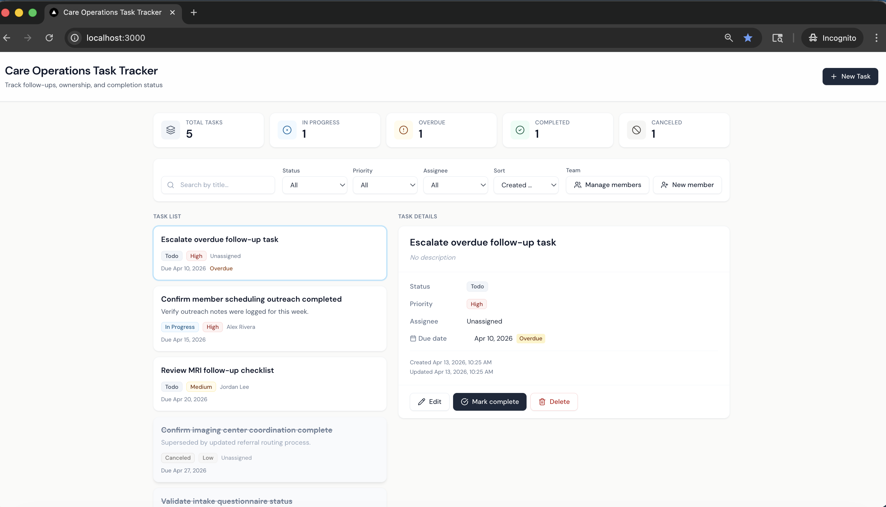
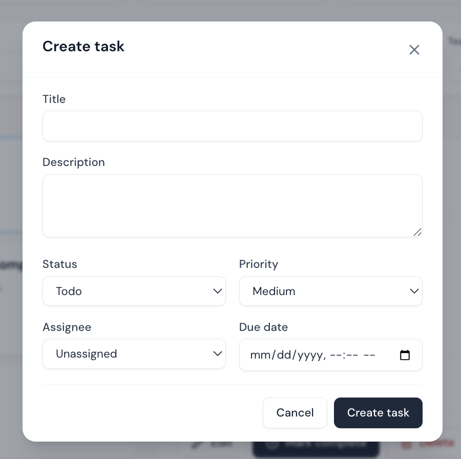
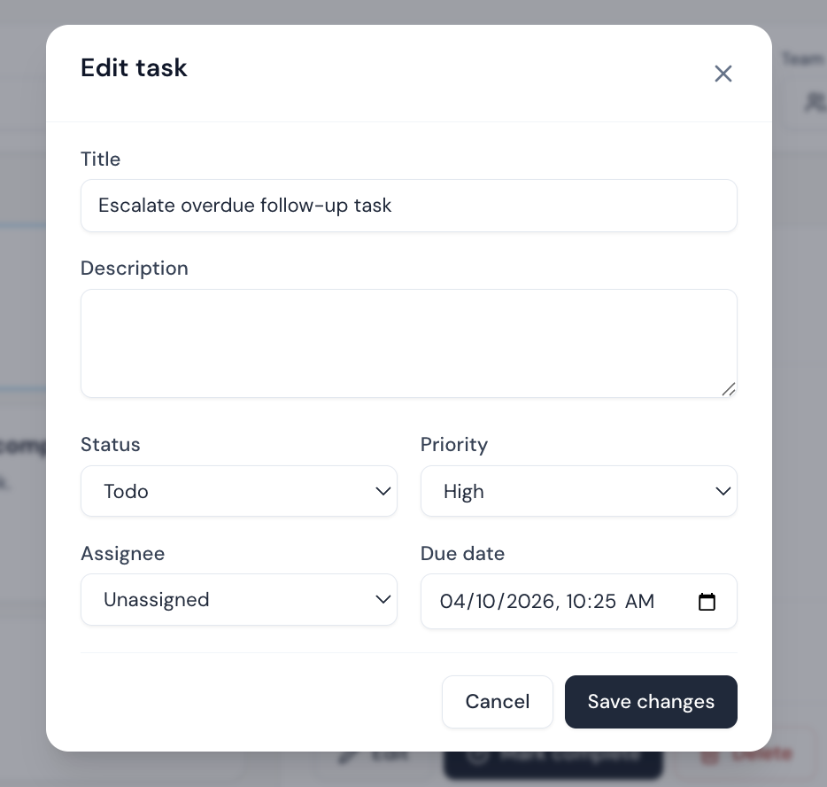
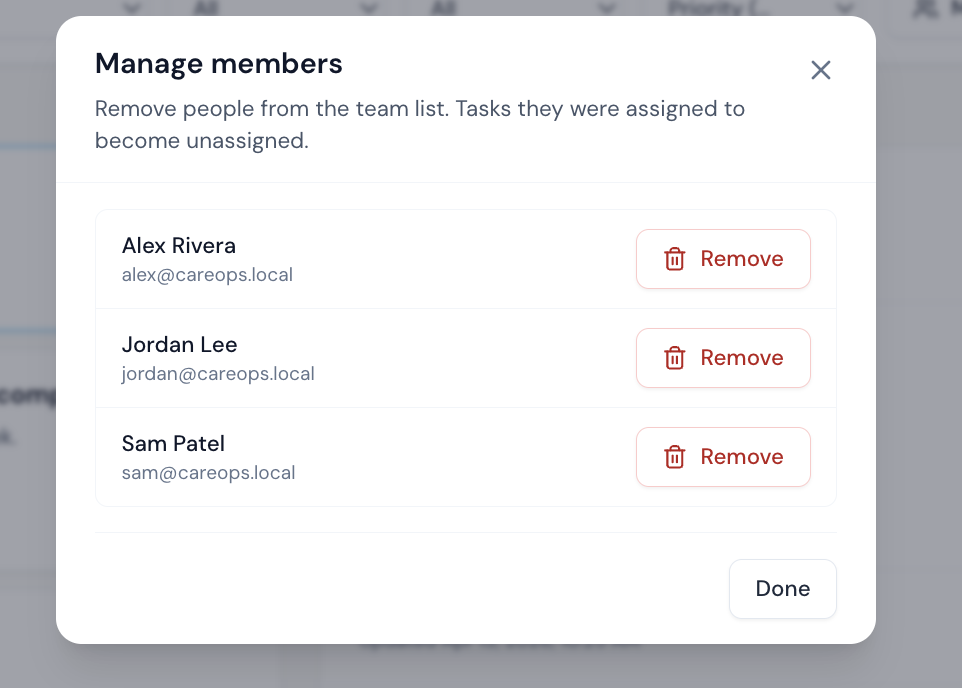
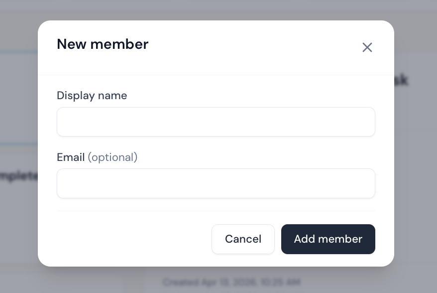
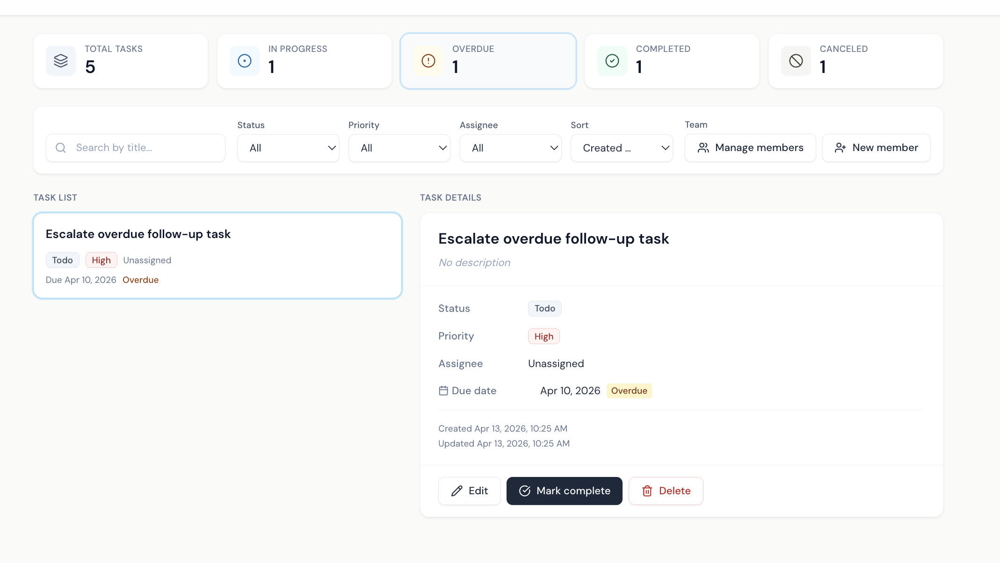
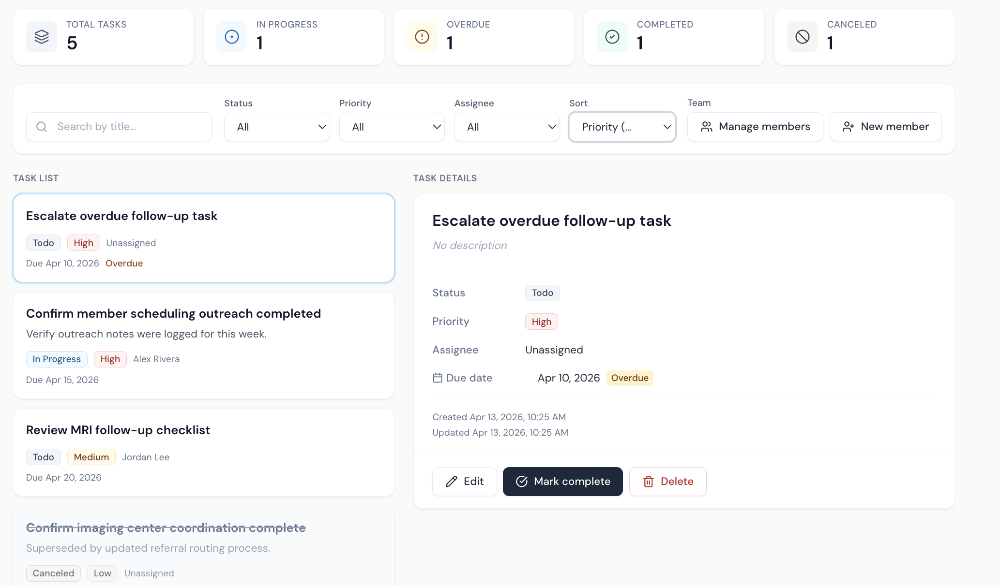

# Care Operations Task Tracker

## Project overview

This repository is a **production-minded MVP**: a single-page **internal operations dashboard** where a small team can manage **tasks** and a **member** roster, assign work, filter and search, and see **overdue** work at a glance. The UI is wired to a **.NET Web API** with **SQLite**, **validation**, **health checks**, **rate limiting**, and **automated tests** (backend integration/unit; frontend component/unit + Playwright E2E).

This root `README.md` is the primary reviewer-facing guide.

## Why this scope

I kept the assignment centered on a **task management** application, but I chose a **light care-operations framing** so the example feels relevant to **Ezra’s mission**. I intentionally **avoided** modeling patients, medical records, or other clinical/compliance-heavy workflows because I wanted to stay aligned with the prompt and keep the scope focused on the **core task-management problem** (CRUD, assignment, filters, sorting, and quality bar for API + UI).

### Why Ezra

My dad died from cancer when I was 20. He was nearly recovered when it metastasized. If it had been caught before it spread, the outcome might have been different.

That is part of why Ezra’s mission resonates so strongly with me. Building earlier-detection tools through full-body MRI screening and AI-supported analysis is not abstract to me.

This project is my take on a small, honest slice of care-adjacent operational tooling. Not clinical software, but built with the belief that better coordination and follow-through across the care journey is worth getting right.

---

## Fastest review path

Use Docker Compose from the repository root:

```bash
cp .env.example .env   # optional: adjust ports
docker compose build
docker compose up
```

This Docker Compose path is the primary local review workflow (not deployment-only).

Open:

- Web app: **http://localhost:3000**
- API base: **http://localhost:5000**
- Swagger (Development): **http://localhost:5000/swagger**
- Health: **http://localhost:5000/health**

---

## Screenshots

### Main dashboard


### Create task modal


### Edit task modal


### Manage members


### Add new member


### Filter: overdue tasks


### Sort: priority


## Local development

Start with the Docker Compose review path below, then use manual setup for day-to-day local development.

**Prerequisites:** [.NET 8 SDK](https://dotnet.microsoft.com/download/dotnet/8.0), **Node.js 20+**, optional **Docker**.

### Docker review path (recommended)

Use the **Fastest review path** section above (same commands and URLs).

### Manual local development

### Backend API (local)

```bash
cd backend
dotnet restore CareOps.sln
dotnet run --project src/CareOps.Api/CareOps.Api.csproj
```

- Swagger: **http://localhost:5000/swagger**  
- Health: **http://localhost:5000/health**

In a second terminal:

### Frontend (Vite dev server, local)

```bash
cd frontend
npm install
npm run dev
```

Open **http://localhost:5173** (Vite proxies `/api` to **http://localhost:5000**).

More frontend-specific notes: [frontend/README.md](frontend/README.md).

---

## Tech stack

| Layer | Choices |
|-------|---------|
| **API** | ASP.NET Core **8 (LTS)** Web API (controllers), **EF Core**, **SQLite**, **FluentValidation**, **Swagger/OpenAPI**, structured errors, **health checks** (`/health`), **ASP.NET Core rate limiting** |
| **Frontend** | **React 19**, **TypeScript**, **Vite**, **Tailwind CSS**, **TanStack Query**, **React Hook Form** + **Zod**, **Sonner** toasts |
| **Delivery** | **Docker Compose** (API + nginx-served SPA), Dockerfiles under `backend/` and `frontend/` |
| **Tests** | **xUnit** + **FluentAssertions** (backend); **Vitest** + Testing Library (frontend); **Playwright** (E2E, Chromium) |

---

## Product scope (what ships in code)

**In scope**

- **Tasks:** create, list, get, update, delete; **patch status** (e.g. complete / reopen / other statuses); assignee optional; due date; **todo / in progress / completed / canceled** statuses; **priority** low / medium / high.
- **Listing:** filter by status, priority, assignee (including unassigned-only); **search** by title substring; **sort** by created date, due date, or priority; optional **overdue-only** filter; list ordering keeps **active** work before **terminal** (completed/canceled) tasks.
- **Members:** list, create, **delete** (tasks become **unassigned** via FK `SetNull`).
- **UX:** dashboard stats, loading/empty/error states, delete confirmation, validation messages.
- **Data:** seeded members and tasks when the database is first created (see `SeedData`).

**Explicitly out of scope** (by design)

- Authentication, passwords, RBAC, invites  
- Patient data, PHI, clinical workflows  
- Redis, queues, microservices, Kubernetes/AWS-specific infra  

---

## Architecture overview

- **Clean layering:** `CareOps.Api` (HTTP, Swagger, middleware) → `CareOps.Application` (services, validators, DTOs, rules) → `CareOps.Domain` (entities, enums) → `CareOps.Infrastructure` (EF Core, SQLite, seeding).
- **Frontend** is a **SPA** that calls **`/api/...`** JSON endpoints. In local dev, **Vite proxies** `/api` and `/health` to the API. In Docker, the **web** container’s **nginx** proxies `/api` to the **api** service.
- **Deeper diagrams and CORS notes:** [docs/architecture.md](docs/architecture.md)  
- **Key technical decisions:** [docs/adr-001-key-decisions.md](docs/adr-001-key-decisions.md)

---

## Data model

- **Member** (`Members`): `Id`, `DisplayName`, optional `Email` / `Title`, `CreatedAtUtc`.
- **TaskItem** (`TaskItems`): `Id`, `Title`, optional `Description`, `Status`, `Priority`, optional `AssigneeMemberId` (FK → `Member`, **on delete: set null**), optional `DueDateUtc`, optional `CompletedAtUtc`, `CreatedAtUtc`, `UpdatedAtUtc`.
- **Status (stored as string in SQLite):** `Todo`, `InProgress`, `Completed`, `Canceled` (JSON uses camelCase, e.g. `canceled`). Legacy value `Cancelled` is accepted on read when loading old rows.
- **Priority:** `Low`, `Medium`, `High`.

Authoritative field detail: [docs/architecture.md](docs/architecture.md) (ER diagram and tables).

---

## API overview

Base path **`/api`**. JSON enums are **camelCase**.

| Method | Path | Notes |
|--------|------|--------|
| `GET` | `/health` | Liveness; includes DB check |
| `GET` | `/api/tasks` | Query: `status`, `priority`, `assigneeMemberId`, `search`, `sortBy`, `sortDir`, `overdueOnly` |
| `GET` | `/api/tasks/{id}` | Single task |
| `POST` | `/api/tasks` | Create (rate-limited: **mutating** policy) |
| `PUT` | `/api/tasks/{id}` | Full update |
| `PATCH` | `/api/tasks/{id}/status` | Status-only update |
| `DELETE` | `/api/tasks/{id}` | Delete |
| `GET` | `/api/members` | List members |
| `POST` | `/api/members` | Create member (**mutating**) |
| `DELETE` | `/api/members/{id}` | Delete member (**mutating**); tasks unassigned |

**Swagger UI** (Development): `http://localhost:5000/swagger` when the API runs with `ASPNETCORE_ENVIRONMENT=Development`.

---

## Security considerations

- **No authentication** in this MVP—assumes a **trusted network** or private demo (see ADR / product brief).
- **Rate limiting:** global per-IP fixed window (**100** requests/minute in non-test environments); **mutating** endpoints use a **stricter** per-IP policy (**30**/minute). Integration tests use a **Testing** environment with very high limits.
- **CORS:** a **LocalFrontend** policy allows known local dev origins (`localhost`/`127.0.0.1` on ports **5173** and **3000**).
- **Secrets:** do not commit real connection strings or `.env` files; use [`.env.example`](.env.example) as a template.

---

## Operational considerations

- **SQLite** file: default local path is `careops.db` under the API working directory; Docker Compose stores the DB in a **named volume** (`sqlite_data` → `/data/careops.db` in the API container).
- **Logs:** ASP.NET Core logging is configured in `appsettings`; request-level **HTTP logging** (method, path, status, duration) is enabled in `Program.cs` for operational visibility. In production you would typically ship logs to a collector and use **JSON** or another structured format at the host.
- **Health:** use **`GET /health`** for load balancers or compose healthchecks (includes a **database** check).
- **Frontend observability (future):** monitor client-side errors and core web vitals (LCP/INP/CLS) in production; this is intentionally documented rather than implemented in the take-home.

**Beyond this MVP:** a fuller deployment would monitor **golden signals** (latency, traffic, errors, saturation) and add **application metrics** such as task creation rate, overdue task count, mutation success rate, and rate-limited request counts—none of which are wired here to keep scope small.

---

## Scalability considerations

- **Current fit:** single API instance + SQLite suits **low concurrency** and the take-home scope.
- **Growth path:** move to **PostgreSQL** (or similar) for concurrent writes and HA; add **auth** and org-aware tenancy for internet-facing use; horizontal scale of **stateless API** instances behind a load balancer; optional **Redis** for sessions/rate-limit buckets if requirements change—**not** included here to avoid over-engineering.

---

## Testing

### Backend

```bash
cd backend
dotnet test CareOps.sln
```

Details: [backend/tests/README.md](backend/tests/README.md).

### Frontend (unit/component)

```bash
cd frontend
npm install
npm run test
```

Watch mode: `npm run test:watch`.

### Frontend (E2E)

Requires **.NET SDK** on `PATH` (starts API + Vite via `frontend/scripts/start-e2e-stack.sh`). One-time browser install:

```bash
cd frontend
npx playwright install chromium
npm run test:e2e
```

All frontend tests (Vitest + Playwright):

```bash
cd frontend
npm run test:all
```

---

## Tradeoffs and future improvements

- **SQLite** keeps local and CI setup fast; production at scale would likely use **PostgreSQL** and migrations strategy aligned with the team.
- I used **`EnsureCreated`** plus seed data to keep local setup friction low for this take-home and optimize reviewer experience. If this project continued beyond the submission, I would switch to a standard EF Core migrations workflow so schema evolution is explicit and versioned.
- **No auth** speeds the MVP; production would add **identity**, **authorization**, and network controls.
- **Single-region / single instance** assumptions; **notifications** (email/Teams), **audit history**, and **real-time** updates are natural follow-ons if users need them.

Extended discussion: [docs/product-brief.md](docs/product-brief.md), [docs/adr-001-key-decisions.md](docs/adr-001-key-decisions.md), [docs/implementation-plan.md](docs/implementation-plan.md).

---

## Repository structure

```
ezra-task-tracker/
├── README.md
├── docker-compose.yml
├── .env.example
├── backend/
│   ├── CareOps.sln
│   ├── Dockerfile
│   ├── src/
│   │   ├── CareOps.Api/           # Web API, Program.cs, controllers
│   │   ├── CareOps.Application/   # Services, FluentValidation, DTOs
│   │   ├── CareOps.Domain/        # Entities, enums
│   │   └── CareOps.Infrastructure/# EF Core, SQLite, seed
│   └── tests/                     # Integration + unit tests
├── frontend/
│   ├── Dockerfile
│   ├── nginx.conf                 # /api proxy to API in Docker
│   ├── playwright.config.ts
│   ├── e2e/                       # Playwright specs
│   ├── src/                       # React app (pages, components, api clients)
│   └── scripts/start-e2e-stack.sh # API + Vite for E2E
└── docs/
    ├── product-brief.md
    ├── architecture.md
    ├── adr-001-key-decisions.md
    └── implementation-plan.md
```

---

## Documentation Map

- [Root `README.md`](README.md): primary reviewer guide (overview, setup, API summary, testing, tradeoffs)
- [`backend/README.md`](backend/README.md) / [`frontend/README.md`](frontend/README.md): component-specific development notes and commands
- [`docs/architecture.md`](docs/architecture.md): architecture diagrams and implementation details
- [`docs/adr-001-key-decisions.md`](docs/adr-001-key-decisions.md): key technical decisions and tradeoffs
- [`docs/product-brief.md`](docs/product-brief.md) / [`docs/implementation-plan.md`](docs/implementation-plan.md): product framing and phased plan

---

## License / use

Private take-home submission unless otherwise stated.
