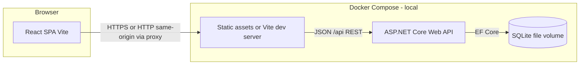
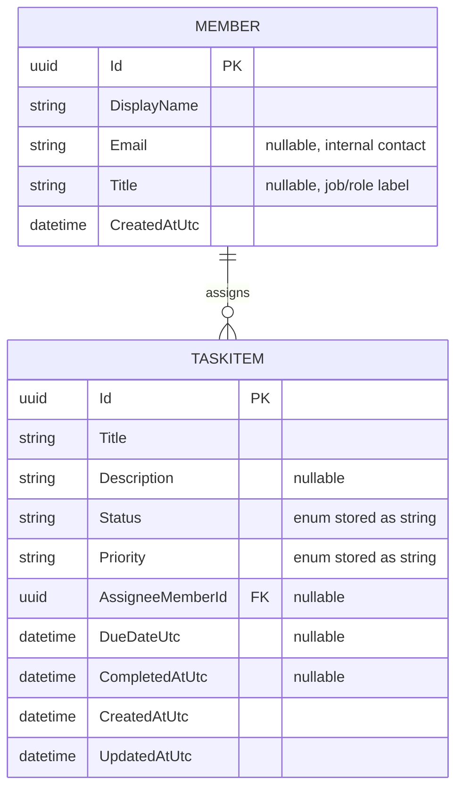
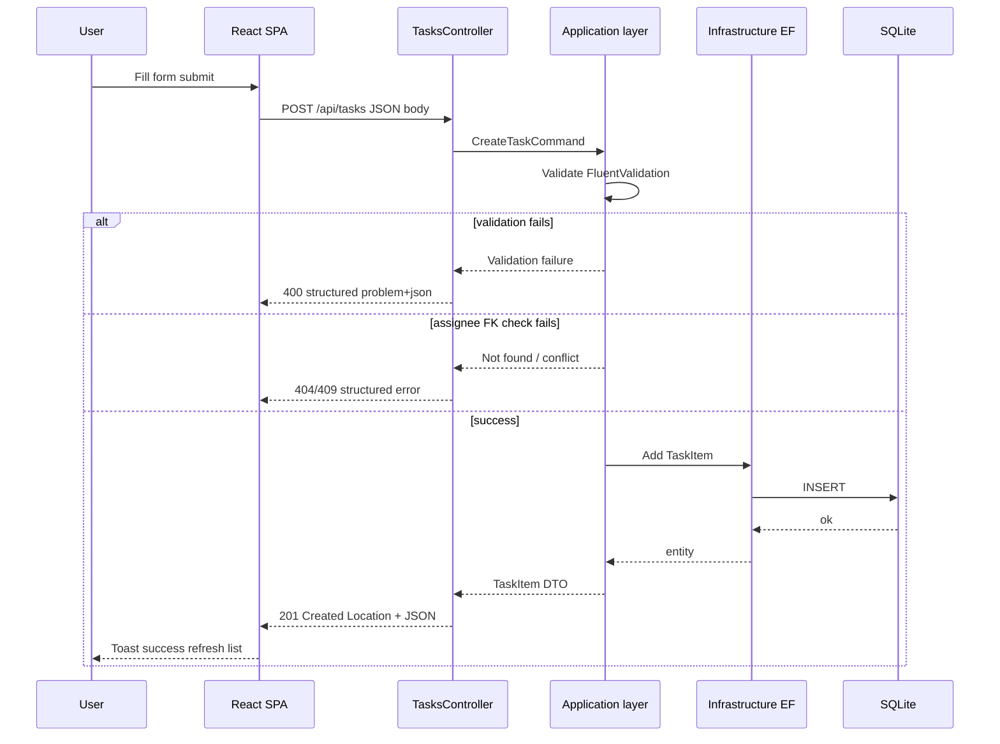
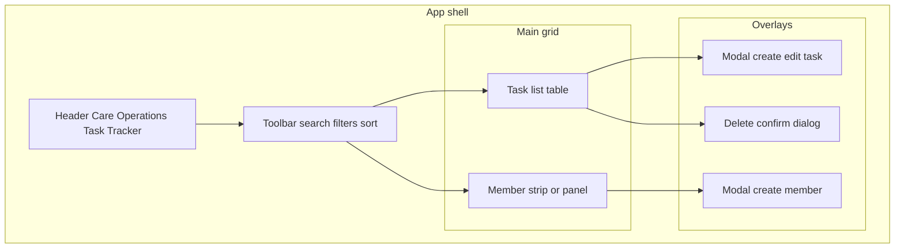

# Architecture — Care Operations Task Tracker

## High-level architecture

In **development**, a common pattern is Vite dev server with **proxy** to the API (`/api` → backend) to avoid CORS friction. In **Docker**, either serve the built SPA behind the same host as the API (reverse proxy) or configure CORS for the known frontend origin—see [CORS approach](#cors-approach). In this repository, Docker Compose is also a supported local review path (not deployment-only), while manual backend/frontend startup remains available for day-to-day development.

---

## ER diagram — Member and TaskItem

Domain naming uses **`TaskItem`** in code to avoid clashing with `System.Threading.Task` in .NET.

### Exact fields (authoritative)

**Member**

| Field | Type | Constraints |
|-------|------|----------------|
| `Id` | `Guid` | PK |
| `DisplayName` | `string` | required, max 200 |
| `Email` | `string?` | optional, max 320, format validated if present |
| `Title` | `string?` | optional job/role label, max 120 |
| `CreatedAtUtc` | `DateTimeOffset` | set on insert |

**TaskItem**

| Field | Type | Constraints |
|-------|------|----------------|
| `Id` | `Guid` | PK |
| `Title` | `string` | required, max 500 |
| `Description` | `string?` | optional, max 4000 |
| `Status` | enum → string | `Todo`, `InProgress`, `Completed`, `Canceled` |
| `Priority` | enum → string | `Low`, `Medium`, `High` |
| `AssigneeMemberId` | `Guid?` | FK → `Member.Id`, optional |
| `DueDateUtc` | `DateTimeOffset?` | optional |
| `CompletedAtUtc` | `DateTimeOffset?` | set when moved to terminal “done” state; cleared on reopen |
| `CreatedAtUtc` | `DateTimeOffset` | set on insert |
| `UpdatedAtUtc` | `DateTimeOffset` | set on insert/update |

**Business rules (implemented)**

- **Complete:** `Status = Completed`, `CompletedAtUtc` set when transitioning to completed (see `TaskItemRules`).
- **Reopen / non-terminal:** moving away from completed clears `CompletedAtUtc`; canceled also clears it.
- **Overdue (UI + API filter):** `DueDateUtc != null` AND `DueDateUtc < UtcNow` AND status is **active** (`Todo` or `InProgress` only).
- **List sort:** active tasks first; **completed** and **canceled** tasks after, then secondary sort by `sortBy` / `sortDir`.

---

## Sequence diagram — Create Task

---

## Frontend dashboard layout (conceptual)

Single route `/` — **one SPA** with an internal ops dashboard layout.

**Screens / UI regions (exact)**

| Region | Responsibility |
|--------|----------------|
| **Header** | Product name, environment hint (optional) |
| **Toolbar** | Search (title), filters (status, priority, assignee), sort controls |
| **Task table** | Rows with title, status, priority, assignee, due, overdue badge, actions |
| **Member panel** | List members + “Add member” |
| **Modals** | Create/edit task; create member; delete confirmation |

No additional routes required for MVP (deep-linking optional later).

---

## Exact API routes

Base path: **`/api`**. JSON only; dates in **ISO 8601** UTC.

### Members

| Method | Route | Description |
|--------|--------|-------------|
| `GET` | `/api/members` | List members (sorted by display name) |
| `POST` | `/api/members` | Create member |
| `GET` | `/api/members/{memberId}` | Get one member |

### Tasks

| Method | Route | Description |
|--------|--------|-------------|
| `GET` | `/api/tasks` | List with query parameters (below) |
| `POST` | `/api/tasks` | Create task |
| `GET` | `/api/tasks/{taskId}` | Get one task |
| `PUT` | `/api/tasks/{taskId}` | Full update |
| `DELETE` | `/api/tasks/{taskId}` | Delete |
| `POST` | `/api/tasks/{taskId}/complete` | Mark complete |
| `POST` | `/api/tasks/{taskId}/reopen` | Reopen |

### Query parameters — `GET /api/tasks`

| Parameter | Example | Description |
|-----------|---------|-------------|
| `status` | `Pending` | Optional; repeat or comma-separated per implementation choice |
| `priority` | `High` | Optional |
| `assigneeMemberId` | UUID | Optional; empty = unassigned filter if supported |
| `search` | `vendor` | Title contains (case-insensitive) |
| `sortBy` | `created` \| `due` \| `priority` | Default `created` |
| `sortDir` | `asc` \| `desc` | Default `desc` for created |
| `overdueOnly` | `true` | Optional; filter overdue rows |

**Note:** Exact query encoding (single vs repeated params) will be fixed in implementation; clients will use one consistent style.

### Health

| Method | Route | Description |
|--------|--------|-------------|
| `GET` | `/health` | Liveness |
| `GET` | `/health/ready` | Readiness (DB can open) |

Swagger UI at `/swagger` in Development.

---

## Layered backend structure (conceptual)

- **Api:** Controllers, middleware registration, Swagger, rate limiting, CORS
- **Application:** Commands/queries, DTOs, validators, interfaces
- **Domain:** Entities, enums, domain rules
- **Infrastructure:** EF Core `DbContext`, migrations, repositories if kept thin

---

## Structured errors

Use **Problem Details** (`application/problem+json`) for failures; include stable `title`, `status`, `detail`, and optional `errors` for validation field errors—aligned with ASP.NET Core conventions.

---

## CORS approach

- **Development:** Prefer **Vite proxy** so the browser talks same-origin; minimal CORS surface.
- **Docker / split origins:** Set **one allowed origin** from configuration (e.g. `Frontend__Origin` or `CORS__AllowedOrigins`). No wildcard credentials.
- **Rationale:** Internal tool still benefits from explicit origin allowlisting to avoid accidental cross-site API use in deployed demos.

---

## Rate limiting rationale

| Policy | Rough limit | Applies to |
|--------|-------------|------------|
| **Global** | ~100 requests / minute / client partition key | All API routes |
| **Mutating** | ~30 requests / minute | `POST`, `PUT`, `DELETE` on `/api/*` |

**Why:** Reduces accidental abuse, scripted tight loops, and noisy clients during demos—without needing Redis. Partition key: **IP** (and optionally forwarded-for if behind a trusted proxy in real deployments).

---

## Observability and golden signals

| Signal | MVP approach |
|--------|----------------|
| **Latency** | ASP.NET Core request logging; optional simple histogram later |
| **Traffic** | HTTP access logs with path + status |
| **Errors** | Structured logs + Problem Details; correlate `TraceIdentifier` |
| **Saturation** | Health/ready + SQLite file accessibility; CPU not central for MVP |

**Logging:** Structured JSON-friendly logs (level, message, exception, request id). No PII beyond internal names/emails already in scope.

**Frontend observability (future):** for production use, add client-side error monitoring and core web vitals tracking (LCP/INP/CLS). This is intentionally documented rather than fully implemented in the take-home.

---

## Security considerations (unauthenticated MVP)

| Topic | Mitigation |
|-------|------------|
| No auth | **Assumption:** internal trusted network or private demo; document that production would add OIDC/API keys |
| **PHI** | Forbidden by scope; validate no clinical fields in models |
| **Injection** | Parameterized queries via EF; validate/sanitize inputs |
| **CORS** | Restricted origins when not using proxy |
| **Rate limit** | Baseline abuse protection |
| **Headers** | Sensible defaults via ASP.NET; avoid verbose server headers in production hardening (later) |

---

## Scaling path

1. **Vertical:** Larger SQLite file on disk; WAL mode; single API instance.
2. **API:** Move to managed DB (**PostgreSQL**) with same EF model; connection pooling; read replicas later.
3. **Auth:** Add organizational SSO (e.g. Entra ID) at gateway or middleware.
4. **Frontend:** CDN for static assets; API behind load balancer when multi-instance.
5. **Background work:** Only if needed—out of scope until requirements justify queues.

---

## Technology choices (pointers)

Deeper rationale: [adr-001-key-decisions.md](./adr-001-key-decisions.md).

- **React + Vite vs Next.js:** SPA dashboard; no SSR requirement; simpler static hosting.
- **SQLite:** Single-file, zero external services, ideal for MVP and CI.
- **No authentication:** Scope and speed; documented threat model for reviewers.

---

## Frontend (current state)

| Topic | Detail |
|--------|--------|
| **Stack** | React (Vite), TypeScript, Tailwind CSS, TanStack Query, React Hook Form + Zod, Sonner toasts |
| **Shape** | Single-page dashboard: header, stats, search/filters/sort, two-column task list + detail panel, modals (create/edit task, create member, delete confirm) |
| **Data** | TanStack Query + `fetch` to **`/api/members`** and **`/api/tasks`** (see `frontend/src/api/`). Enums match backend JSON (**camelCase** string enums). |
| **Mutations** | POST/PUT/PATCH/DELETE with `queryClient.invalidateQueries({ queryKey: ["tasks"] })` / `["members"]` after success; forms map ASP.NET validation errors into react-hook-form fields where possible. |
| **Dev proxy** | `npm run dev` proxies `/api` and `/health` to `http://localhost:5000`. Optional **`VITE_API_BASE_URL`** when the SPA is built without a proxy. |
| **Production image** | Multi-stage Dockerfile: `npm ci`, `npm run build`, nginx serves `dist/` with SPA fallback (`frontend/nginx.conf`). |

---

## Local setup (current repo)

**Docker Compose local review (recommended):**
1. Copy **`.env.example`** to **`.env`** (optional; defaults work for ports `5000` / `3000`). The example file contains no secrets.
2. From the repo root: **`docker compose build`** then **`docker compose up`**.
3. **Web:** **http://localhost:3000** — built SPA (nginx).
4. **API:** **http://localhost:5000** (mapped port) — Swagger at `/swagger` in Development, REST under `/api`.

**Manual local development (no Docker):**
- Backend: run API from `backend/` with `dotnet run --project src/CareOps.Api/CareOps.Api.csproj`.
- Frontend: run Vite from `frontend/` with `npm run dev` (proxying `/api` to backend).

See root **`docker-compose.yml`**, **`backend/Dockerfile`**, **`frontend/Dockerfile`**, **`frontend/nginx.conf`**, and **`.env.example`**.

## Docker (compose services)

- **API container:** ASP.NET Core, SQLite on a **named volume** (`/data`), `/health` for readiness.
- **Frontend container:** nginx serving Vite **`dist/`** (multi-stage build).
- **Compose:** Services, env, port mapping — phased history in [implementation-plan.md](./implementation-plan.md).
