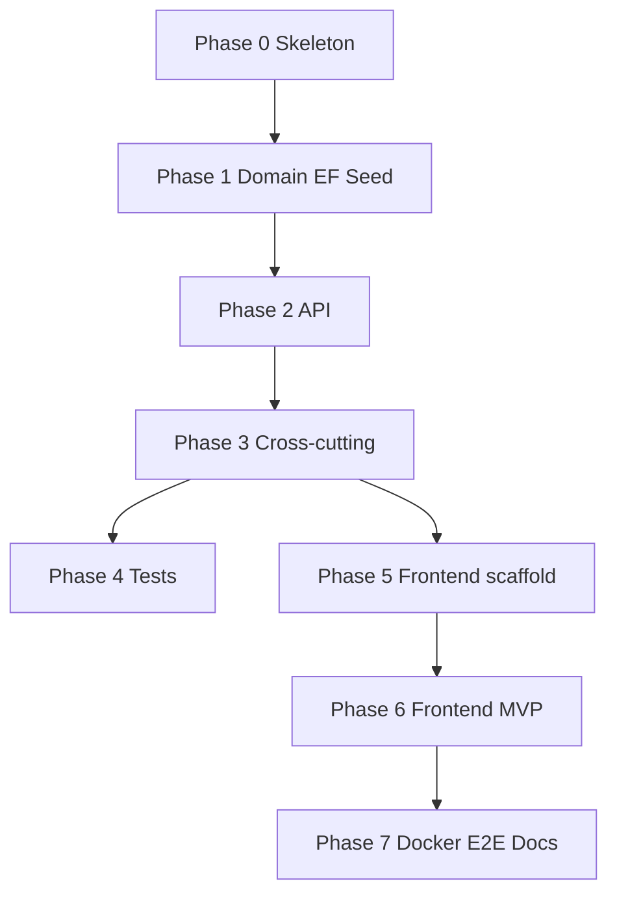

# Implementation plan — Care Operations Task Tracker

Phased delivery: **documentation first** (this phase), then backend foundation, then API features, then frontend, then hardening and polish. **No application code was generated in the planning phase.**

---

## Exact repo structure (target)

```
ezra-task-tracker/
├── README.md
├── docker-compose.yml
├── .env.example
├── .gitignore
├── backend/
│   ├── CareOps.sln
│   ├── src/
│   │   ├── CareOps.Api/
│   │   ├── CareOps.Application/
│   │   ├── CareOps.Domain/
│   │   └── CareOps.Infrastructure/
│   └── tests/
│       ├── CareOps.Api.Tests/
│       └── CareOps.Application.Tests/
├── frontend/
│   ├── package.json
│   ├── vite.config.ts
│   ├── index.html
│   ├── src/
│   │   ├── main.tsx
│   │   ├── App.tsx
│   │   ├── api/
│   │   ├── components/
│   │   ├── hooks/
│   │   └── types/
│   └── public/
└── docs/
    ├── product-brief.md
    ├── architecture.md
    ├── adr-001-key-decisions.md
    └── implementation-plan.md
```

Naming adjustments (e.g. `CareOps` vs `Ezra`) can be made when the solution is created; structure stays the same.

---

## Phased implementation plan

### Phase 0 — Repository and Docker skeleton

**Goal:** Runnable empty API container + compose wiring; frontend placeholder optional.

| Step | Task |
|------|------|
| 0.1 | Create `backend/` solution and four projects (Api, Application, Domain, Infrastructure) + test projects |
| 0.2 | Wire project references: Api → Application, Infrastructure; Application → Domain; Infrastructure → Application + Domain |
| 0.3 | `docker-compose.yml`: API service, env for connection string and URLs; volume for SQLite path |
| 0.4 | `.env.example`: ports, `ConnectionStrings__Default`, `CORS`/`Frontend` origin, logging level |
| 0.5 | README section “How to run” updated with real commands |

**Exit:** `docker compose up` starts API; `/health` returns OK (once implemented in Phase 2).

---

### Phase 1 — Domain, EF Core, SQLite, seed

| Step | Task |
|------|------|
| 1.1 | Domain: `Member`, `TaskItem`, enums `TaskStatus`, `TaskPriority` |
| 1.2 | Infrastructure: `DbContext`, configurations, unique indexes as needed |
| 1.3 | Migrations; ensure SQLite file path works in Docker volume |
| 1.4 | Seed: 3–5 members, 8–12 tasks with varied status/priority/due/overdue |

**Exit:** Database created and seeded on startup (dev).

---

### Phase 2 — API: Members and Tasks (CRUD + actions)

| Step | Task |
|------|------|
| 2.1 | DTOs + FluentValidation for requests |
| 2.2 | `MembersController`: GET list, POST, GET by id |
| 2.3 | `TasksController`: GET list (filters/sort/search), POST, GET by id, PUT, DELETE |
| 2.4 | `POST .../complete` and `POST .../reopen` with idempotent behavior |
| 2.5 | Structured Problem Details for errors; 404 for missing entities |

**Exit:** Swagger exercises full task/member lifecycle.

---

### Phase 3 — Cross-cutting: logging, health, rate limiting, Swagger polish

| Step | Task |
|------|------|
| 3.1 | Request logging + correlation id |
| 3.2 | `/health`, `/health/ready` with DB check |
| 3.3 | Rate limiting: global + mutating stricter policy |
| 3.4 | Swagger/OpenAPI titles, versions, XML comments if enabled |

**Exit:** Observable, demo-ready API behavior.

---

### Phase 4 — Tests

| Step | Task |
|------|------|
| 4.1 | Integration tests: members + tasks CRUD, filters, complete/reopen |
| 4.2 | Unit tests: validators, overdue predicate, status transitions |

**Exit:** CI-ready test command documented in README.

---

### Phase 5 — Frontend scaffold *(largely complete)*

| Step | Task |
|------|------|
| 5.1 | Vite + React + TS + Tailwind + TanStack Query + RHF + Zod |
| 5.2 | **Pending:** API client module (base URL from env); parse Problem Details from failed responses |
| 5.3 | App shell: header, stats, controls, two-column layout, modals — per [architecture.md](./architecture.md) dashboard section |

**Exit achieved (UI shell):** App runs at `http://localhost:5173` with mock-backed queries and full layout. **Not done:** real HTTP calls to `/api/*`.

---

### Phase 6 — Frontend features (MVP UI) *(partial — mocks)*

| Step | Task |
|------|------|
| 6.1 | Task list with loading/empty/error states — **done** (mocks + skeletons) |
| 6.2 | Filters, search, sort — **done** client-side on mock data |
| 6.3 | Create/edit task modals; delete confirm; toasts — **done** (demo toasts; no persistence) |
| 6.4 | Create member + assignee dropdown — **UI done**; new members do not appear until API wiring |
| 6.5 | Overdue indication — **done** in list + detail |

**Exit:** Product-brief checklist satisfied **in the UI** with mock data; **end-to-end against the API** remains for a follow-up phase (“Phase 6b — API integration”).

---

### Phase 7 — Docker end-to-end and documentation pass

| Step | Task |
|------|------|
| 7.1 | Production-like compose: API + nginx for SPA **or** documented dev proxy |
| 7.2 | Final README: assumptions, runbook, test commands, known limitations |
| 7.3 | Sync docs if API query param style or enums differ slightly |

**Exit:** Reviewer can run one path from README and use the app.

---

## Docker setup plan / skeleton notes

| Concern | Plan |
|---------|------|
| **SQLite persistence** | Mount a **volume** to `/data` (or similar); connection string points to `/data/careops.db` |
| **API** | Multi-stage Dockerfile: SDK build, runtime image, expose port 5000/8080 per ASP.NET defaults |
| **Frontend** | Build stage `npm ci && npm run build`; nginx serves `dist/` with SPA fallback to `index.html` |
| **CORS** | If nginx routes `/api` to API and `/` to static, browser same-origin—**preferred for Docker demo** |
| **Environment** | `ASPNETCORE_ENVIRONMENT=Development` locally; `Production` for stricter defaults when desired |
| **Secrets** | No secrets in MVP; `.env` not committed—use `.env.example` only |

Root **`docker-compose.yml`**, **`.env.example`**, **`backend/Dockerfile`**, **`frontend/Dockerfile`**, and **`.dockerignore`** files are in place as a **skeleton**; Phase 0 still adds the .NET solution and replaces placeholder images with real builds.

---

## Dependency order (DAG)



**Status (high level):** Phases **0–4** (backend, tests) and **frontend foundation** (Vite dashboard UI with mocks) are in the repo. **Remaining:** wire the SPA to real `/api/*` HTTP calls (replace mocks), align any query-param naming with the live API, then final Docker/CORS verification if serving from split origins.

---

**Original “next phase” note:** Phase 0 was the starting point; backend and tests have since landed—see root **README** and **docs/architecture.md** for current behavior.
